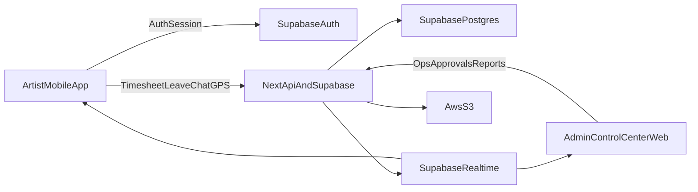

# ctrack_plan

## Target Outcome

Deliver a world-class VFX artist management system with:

- Mobile web app that behaves like an installed app (PWA-first UX, offline-resilient, push-capable where platform allows)
- Daily timesheets, leave workflow, task/project/shot selection, team/group chat (text/audio/image), GPS tracking, and personal dashboard (today/tomorrow)
- Native-like mobile notification experience (push, in-app inbox, action buttons, badge counts, deep links)
- Admin web control center for operations, approvals, assignments, live tracking, and reporting
- Shared backend/data model with existing `ctrack_v0` (Supabase + S3), avoiding duplicate systems

## Strategic Product Suggestions (Make It Better)

- Artist-first workflow: reduce daily input to under 60 seconds with smart defaults (last used project/shot/task, one-tap copy yesterday).
- Studio operations automation: SLA timers, escalation rules, and exception queues so supervisors handle only high-impact issues.
- Predictive planning: highlight tomorrow risk (`overbooked_artist`, `unassigned_critical_shot`, `leave_conflict`) from schedule + leave + task load.
- Wellness guardrails: overtime alerts, continuous-work warnings, and optional mandatory break reminders.
- Trust and privacy by design: transparent location indicators, clear policy text, role-scoped visibility, retention auto-clean.
- Quality and delivery intelligence: correlate timesheet effort vs shot progress to detect blockers early.
- Design principle: simple elegant UI first, advanced controls progressive disclosure only when needed.

## Mobile Visual Design Direction (Apple-native Glassy Style)

- Visual style: premium, minimal, calm, and highly readable; avoid clutter and heavy gradients.
- Surface language: soft translucent cards (`glass`) with subtle blur, layered depth, and light border highlights.
- Motion language: smooth spring transitions, gentle micro-interactions, no distracting animations.
- Typography: large clear hierarchy, high contrast, generous spacing, thumb-friendly touch targets.
- Color strategy: neutral base + limited accent colors only for priority/status actions.
- Interaction model: one primary action per screen, secondary actions collapsed into sheets/menus.
- Accessibility: dynamic text scaling, haptic-equivalent feedback where available, high contrast mode support.

## Existing Foundation To Reuse

- Core app/data stack in [d:/dev/track/ctrack_v0](d:/dev/track/ctrack_v0): Next.js + Supabase + S3 already has projects/shots/tasks/timelog/leaves.
- Current time/leave logic in [d:/dev/track/ctrack_v0/lib/services/timeit-service.ts](d:/dev/track/ctrack_v0/lib/services/timeit-service.ts) and UI in [d:/dev/track/ctrack_v0/app/timeit/page.tsx](d:/dev/track/ctrack_v0/app/timeit/page.tsx).
- Storage abstraction and S3 capability in [d:/dev/track/ctrack_v0/lib/services/storage-service-factory.ts](d:/dev/track/ctrack_v0/lib/services/storage-service-factory.ts) and [d:/dev/track/ctrack_v0/lib/services/s3-storage-service.ts](d:/dev/track/ctrack_v0/lib/services/s3-storage-service.ts).
- Existing mobile baseline in [d:/dev/track/mobile](d:/dev/track/mobile) with Expo Router + Supabase auth; this will be the `ctrack_mobile` product base.

## Product Architecture (Chosen)

- **Single source of truth**: Supabase Postgres + RLS for all core domains.
- **Chat backend**: Supabase Realtime + Postgres tables; media/audio attachments stored in S3 and referenced in chat messages.
- **GPS mode**: Continuous background tracking with explicit user consent, policy controls, and retention limits.
- **Clients**:
  - Mobile-first app (Expo web + native wrappers where needed for deep mobile parity)
  - Desktop admin control center (Next.js web in `ctrack_v0` admin area)



## Domain Model Additions

Add migrations in [d:/dev/track/ctrack_v0/supabase/migrations](d:/dev/track/ctrack_v0/supabase/migrations) for:

- `chat_rooms` (project/department/team scoped)
- `chat_room_members`
- `chat_messages` (text, image, audio, system)
- `chat_attachments` (s3_key, mime, duration, size, waveform optional)
- `artist_location_tracks` (user_id, lat, lng, accuracy, speed, heading, battery, captured_at)
- `location_sessions` (start/end, source app/device, policy snapshot)
- `timesheet_entries` refinements if needed for stronger mobile workflows (draft/finalized flags)
- `notification_events` for assignment/chat/leave/status updates
- `user_notification_preferences` (push/in-app/email by event type, quiet hours, sound/vibrate)
- `device_push_tokens` (user_id, platform, token, last_seen_at, is_active)

RLS policy principles:

- Artist can read/write own timesheets/leaves/location records.
- Artist can read/write only rooms where member.
- Admin/supervisor/production roles can moderate and audit by scope.
- Location visibility restricted to authorized management roles.

## Mobile Experience Blueprint (`ctrack_mobile`)

Primary codebase target: [d:/dev/track/mobile](d:/dev/track/mobile)

### Core Screens

- Home/Dashboard: today tasks, tomorrow tasks, pending approvals, active timer, unread chats.
- Timesheet: day-wise logging by Project → Shot → Task with total hours validation.
- Leave: apply/track leave status and comments.
- Chat: 1:1 + group rooms, media/audio messages, typing/read states, robust retry.
- Tasks: assigned/overdue/completed lanes with quick updates.
- Location status: tracking indicator, permission state, last sync.
- Profile/settings: install app prompt state, privacy settings, sign-out.
- Tools & reminders hub: personal productivity tools (focus timer, checklist, break reminder, deadline nudges, shift start/end reminders).

### PWA + Install Strategy

- Add web manifest, icons, theme colors, standalone display mode.
- Add service worker caching strategy (app shell + API-safe cache rules).
- “Add to Home Screen” UX:
  - show install CTA for first-time eligible user
  - persist dismissal/installed state
  - hide once installed or user permanently dismisses
- iOS Safari path: guided install instructions + capability fallback where APIs differ.

### Native-like Notifications (Mobile First)

- Notification channels: `chat_message`, `task_assigned`, `task_due_soon`, `leave_status`, `timesheet_reminder`, `admin_broadcast`.
- Delivery modes:
  - push notification (device)
  - in-app real-time toast/banner
  - notification center/inbox with read/unread states
- Behavior:
  - deep link open into exact screen (chat room/task/leave detail)
  - grouped notifications for busy chat rooms
  - badge counts on app icon/tab
  - actionable quick actions (reply/mark-done/approve where role allows)
- Platform strategy:
  - Android Chrome PWA: web push with service worker
  - iOS Safari PWA: web push where supported + graceful fallback to in-app alert
  - Native wrapper path for full parity if studio requires guaranteed background delivery
- Reliability:
  - dedup IDs and idempotent event processing
  - retry queue and dead-letter handling for failed sends
  - notification analytics (delivered/opened/actioned)

### Artist Tools and Reminder System

- Smart reminder engine:
  - shift start reminder
  - timesheet incomplete reminder
  - task due-soon and overdue nudges
  - break and overtime wellness reminders
  - leave approval status updates
- Focus tools:
  - pomodoro/focus timer linked to active task
  - one-tap start/stop with automatic timesheet draft
  - daily checklist (`must complete today`)
- Scheduling helpers:
  - tomorrow planning card at day-end
  - conflict hints when leave overlaps critical tasks
  - auto-suggest best next task based on deadline and dependencies
- Quiet intelligence:
  - no-spam bundling during peak hours
  - digest mode for low-priority updates
  - user-level customization per reminder type

### Real-time Chat

- Supabase Realtime channel per room.
- Optimistic send with retry queue.
- Audio recording from mobile:
  - supported (web/native capability checks)
  - max duration + compression + S3 upload + message reference
- Image messages with size/compression constraints.
- No “shot pictures” domain upload in this module (per requirement); only chat attachments where policy allows.

### GPS Background Tracking (Always-on mode)

- Permission onboarding with legal/consent copy.
- Background update loop with battery-aware throttling policy.
- Secure upload batching and retry.
- Hard controls:
  - organization-level retention window
  - audit trail
  - user-visible tracking state
  - emergency stop policy handling
  - shift-based policy templates to reduce unnecessary tracking noise

## Admin Control Center (Desktop Web)

Target inside [d:/dev/track/ctrack_v0/app](d:/dev/track/ctrack_v0/app) and admin APIs in [d:/dev/track/ctrack_v0/app/api/admin](d:/dev/track/ctrack_v0/app/api/admin).

### Admin Modules

- Live Operations Dashboard: active artists, online/offline, current task, leave-on-duty mix.
- Time & Attendance: daily/weekly approvals, anomalies, missing logs.
- Leave Center: approve/reject with audit, calendar overlays.
- Task Control: assignment/reassignment, priorities, bottlenecks.
- Chat Moderation: room controls, retention policies, flagged content.
- GPS Monitor: live map, route replay, geofence alerts, compliance exports.
- Reporting: utilization, overtime, SLA, project burn-down, team velocity.

### Full Control Center Capability Matrix

- Workforce Command: role/permission control, roster planning, shift windows, lock/unlock artist actions.
- Notification Command: broadcast composer, targeted campaigns, quiet-hour policies, delivery health monitor.
- Chat Governance: room lifecycle, message retention, moderation actions, legal hold/export.
- Task Operations: bulk assignment, SLA rules, escalation automation, dependency exception handling.
- Location Governance: geofence policies, exception alerts, privacy override approvals, audit exports.
- System Reliability: API health, queue/retry dashboards, webhook failures, incident center.

## API/Service Work Packages

Enhance existing API patterns in [d:/dev/track/ctrack_v0/app/api](d:/dev/track/ctrack_v0/app/api):

- `POST/GET /api/mobile/timesheets`
- `POST/GET /api/mobile/leaves`
- `POST/GET /api/mobile/chat/rooms`
- `POST /api/mobile/chat/messages`
- `POST /api/mobile/chat/upload-url` (presigned S3)
- `POST /api/mobile/location/batch`
- `GET /api/mobile/dashboard`
- `POST /api/mobile/notifications/register-token`
- `GET /api/mobile/notifications`
- `POST /api/mobile/notifications/read`
- `POST /api/admin/notifications/broadcast`
- `POST /api/mobile/reminders/snooze`
- `POST /api/mobile/reminders/preferences`
- `GET /api/mobile/tools/focus-state`
- admin endpoints for moderation/analytics/location monitoring

Use shared validation schemas and role checks, aligned with existing auth context in [d:/dev/track/ctrack_v0/lib/auth-context.tsx](d:/dev/track/ctrack_v0/lib/auth-context.tsx).

## Security, Compliance, Reliability

- Strict RLS everywhere + server-side authorization on privileged APIs.
- Signed URL access for chat media with TTL.
- Data retention and deletion jobs (chat + location).
- Rate limits for chat/message/media endpoints.
- Encryption-in-transit and secure key management.
- Observability: error tracking, API latency dashboards, message delivery and sync metrics.
- Notification compliance: opt-in/out records, quiet hours enforcement, region-aware privacy controls.

## Delivery Phases

1. **Foundation (2-3 weeks)**
  - Final schema migrations + RLS + core mobile API contracts
  - PWA baseline and install flow
  - Dashboard/timesheet/leave mobile production quality
  - notification infrastructure (token register, preference model, in-app inbox skeleton)
2. **Realtime Collaboration (2-3 weeks)**
  - Supabase chat, room management, text/image/audio messaging
  - S3 media pipeline and chat history retention
  - real-time chat notifications + deep links + badge sync
3. **Location Intelligence (2-3 weeks)**
  - Background tracking pipeline, admin live map, policy/retention controls
4. **Admin Excellence (2-3 weeks)**
  - Control center modules, approvals, analytics, compliance exports
  - notification command center and operations automations
5. **Hardening & Launch (2 weeks)**
  - Load/perf testing, security review, QA matrix (Android Chrome/iOS Safari/Desktop)
  - rollout strategy and monitoring runbooks

## Acceptance Criteria

- Artists can log daily hours against project/shot/task with validation and approvals.
- Leave requests fully manageable from mobile and admin center.
- Chat supports group/text/image/audio with durable history in S3-backed references.
- Continuous GPS tracking operates with consent and admin visibility controls.
- App can be installed to home screen; install CTA auto-hides once completed.
- Notifications feel native-grade: push + in-app inbox + deep link actions + badge consistency.
- Admin dashboard provides live operations and actionable controls from desktop web.
- All new features share `ctrack_v0` auth/db model without duplicate identity stores.

## Layout Direction (High-Level UX)

- Mobile navigation: bottom tabs (`Home`, `Time`, `Chat`, `Tasks`, `Profile`) + contextual FAB for quick log/message.
- Home prioritizes: active timer, today/tomorrow tasks, pending actions, alerts, and notification summary card.
- Chat uses WhatsApp-like simplicity: room list, unread badges, quick media/audio composer.
- Admin desktop uses left rail + top KPI strip + module workspaces, optimized for operations teams.
- Mobile visual tone: glassy cards, soft blur, elegant spacing, simple iconography, and minimal visual noise.

## UI Layout Blueprint (Detailed)

### Mobile App Layout

- `Home`: sticky top bar (avatar, shift status, notifications), KPI strip, active timer card, `Today` list, `Tomorrow` list, quick action dock.
- `Time`: calendar rail + day detail, project-shot-task pickers, hour chips, save/submit bar fixed at bottom.
- `Chat`: room list with segmented filters (`All`, `Project`, `Team`, `Direct`), room screen with pinned composer and media actions.
- `Tasks`: kanban-like segmented lanes (`Today`, `Upcoming`, `Overdue`, `Done`) optimized for thumb reach.
- `Profile`: install status, notification settings, location permissions, privacy controls, account actions.
- `Tools`: reminders center, focus timer, daily checklist, quick health/break controls.

### Admin Web Layout

- Global shell: left navigation rail, top command bar, center workspace, right contextual inspector panel.
- Operations landing: live KPIs + incident feed + map widget + approval queues.
- Workforce workspace: roster grid, attendance timeline, assignment board, policy panel.
- Communication workspace: chat governance, announcement composer, notification analytics.
- Compliance workspace: GPS audits, retention jobs, permission events, export center.

## ASCII UI Layouts

### Mobile Home (Artist)

```text
+--------------------------------------------------+
| 09:41  CTrack  [Shift: ON]       [Bell 3] [AV] |
+--------------------------------------------------+
| KPI: Today 7.5h | Pending 2 | Unread 5         |
+--------------------------------------------------+
| ACTIVE TIMER                                       |
| Project: Dragon_EP03   Shot: SH_120   Task: Comp |
| [Pause] [Stop] [Switch Task]                      |
+--------------------------------------------------+
| TODAY TASKS                                        |
| 1) SH_120 Comp   Due 6pm   [Start]               |
| 2) SH_095 Prep   Overdue   [Update]              |
+--------------------------------------------------+
| TOMORROW PREVIEW                                   |
| SH_141 Lighting   SH_200 Review                   |
+--------------------------------------------------+
| REMINDERS: Shift Start 09:00 | Timesheet 06:30pm |
+--------------------------------------------------+
| Quick: [Log Time] [Apply Leave] [Focus Tool]     |
+--------------------------------------------------+
| Home | Time | Chat | Tasks | Profile             |
+--------------------------------------------------+
```

### Mobile Tools & Reminders

```text
+--------------------------------------------------+
| <- Tools and Reminders                  [Prefs] |
+--------------------------------------------------+
| FOCUS TIMER                                       |
| Task: SH_120 Comp            [25:00] [Start]     |
+--------------------------------------------------+
| TODAY CHECKLIST                                   |
| [ ] Submit timesheet                              |
| [ ] Finish SH_120 comp pass                       |
| [x] Join 11:30 review                             |
+--------------------------------------------------+
| SMART REMINDERS                                   |
| Shift Start            08:50   [On]               |
| Timesheet Incomplete   18:30   [On]               |
| Break Reminder         14:00   [On]               |
| Overtime Alert         20:00   [On]               |
+--------------------------------------------------+
| [Snooze 15m] [Mark Done] [Open Task]             |
+--------------------------------------------------+
```

### Mobile Chat Room

```text
+--------------------------------------------------+
| <- Team_Comp_EP03                 [Call] [Info] |
+--------------------------------------------------+
| [10:14] Lead: pls finish SH_120 before 6pm       |
| [10:16] You: rendering now                        |
| [10:18] ArtistA: [Voice 00:12]                    |
| [10:20] You: [Image] preview_v03.webp             |
| ...                                               |
+--------------------------------------------------+
| [+] [Mic] Message...                     [Send]  |
+--------------------------------------------------+
```

### Admin Control Center (Desktop)

```text
+--------------------------------------------------------------------------------------------------+
| CTrack Control Center                 Search...                       Alerts(8)   AdminProfile  |
+----------------------+------------------------------------------------+-------------------------+
| NAV                  | LIVE OPS DASHBOARD                             | CONTEXT PANEL          |
| - Overview           | KPIs: ActiveArtists 84 | MissingLogs 12        | Selected: Artist_204   |
| - Workforce          |      LeaveToday 9      | CriticalShots 17      | Shift: ON              |
| - Time&Leave         +------------------------------------------------+ Task: SH_120 Comp      |
| - Tasks              | INCIDENT FEED                                   | Last GPS: 10:21        |
| - Chat Governance    | - SH_221 blocked (dependency)                  | Leave: none            |
| - Notifications      | - 5 artists over SLA in Comp queue             | Quick Actions:         |
| - GPS Monitor        +------------------------------------------------+ [Message] [Reassign]   |
| - Compliance         | MAP / TRACKING                                  | [Escalate] [Approve]   |
| - Reports            | [Live map + geofences + route replay]          |                         |
+----------------------+------------------------------------------------+-------------------------+
| Approval Queue: Timesheets(27) | Leaves(6) | Escalations(4)                                       |
+--------------------------------------------------------------------------------------------------+
```

## Feature Set (World-Class VFX Studio Edition)

- Smart Timesheet Engine: one-tap fill, rule validation, overtime policy, correction request flow.
- Leave Intelligence: team-impact preview before submit, overlap warnings, backup assignee suggestion.
- Production Chat: project/sequence/shot scoped rooms, pinned notes, voice + image support, quick mentions.
- Task Command: priority lanes, dependency awareness, auto-reminders for due and blocked states.
- Live Location Operations: geofence exceptions, route replay, shift timeline, auditable compliance trail.
- Notification Excellence: native-like delivery, grouped alerts, actionable notifications, full preference control.
- Admin Decision Hub: anomaly detection, workload balancing, bottleneck heatmaps, exportable operational reports.
